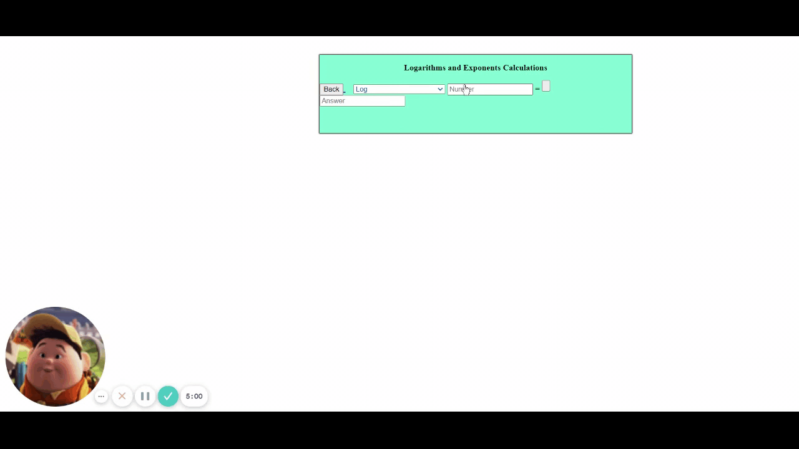

## The Gators Spring - Calculator Hub Website!

The project developers are Pranav Kambhampati, Neil Sahai, Aryan Amberkar, and Praveen Natarajan

This portfolio is composed of a website with a bunch of online calculators - use this whenever you are stuck on your math homework!

## Usage
Prerequisites:

- Java JDK
- IntelliJ Ultimate
- Access to a Web Browser

All of our labs can be accessed by building the project and typing localhost:8080 in your browser after cloning our repository.

Alternatively, you can find our website deployed at the website link [here](https://csa-gators-calculator-suite.herokuapp.com/)

## Features - more to come soon

| Lab | Description |
| --- | --- |
| 4 function Calculator | Calculator with many functions like addition, subtraction, multiplication, division. 
| Trigonometry Calculator | Calculator with sine, cosine, and tangent functions, which are calculated in radians.
| Conversions Calculator | Calculator with conversions between imperial and metric units. Includes length, mass, and temperature conversions.
| Logarithm and Exponent Calculator | A calculator with both natural log and log functions, In addition to some exponent bases. |

## Full Completed Calculator Demos

### 4 Way Calculator

### Conversions Calculator

### Trigonmetric Calculator

### Logarithm and Exponent Calculator - last 3 are exponents

## Communication
- NATM link: Will be posted shortly
- Commercial Video can be found shortly
- Heroku Suite Deployment can be view above, alternatively it can be found at this [link](https://csa-gators-calculator-suite.herokuapp.com/).
- [The Gators Spring Scrum Board](https://github.com/aryan114/APCSA-The-Gators-Spring/projects/1)
- [Calculator Playround Scrum Board](https://github.com/PranavKambhampati/CalculatorHubPlayground/projects/1)

## Technicals

- Project was built in HTML, CSS, Javascript, and Java.
- Built website using the thymeleaf template engine to deploy fragments which would then be implented into the index.html file.
- In order to complete our learning experience and to learn further about the Web, Javascript was implemented into the calculators/labs.
- Developed CSS Animations and a clean immersive layout.
- Layered Approach to CSS, HTML, and Javascript as described in Mr. M's tech talk.
- Developed Navbar in HTML to route to all the assembled pages.
- Event Based Programming when clicking buttons to display the results in the calculator and to reroute to .html pages.
- Persistent Java Backend implemented through calculator logic.
- AP FRQs integrated into web page using our own researched embed - Easter Egg for the project.
- We explored how JSON works with Rest APIs through a lab that prints Hello World. This can be changed by changing the URL to pass in a different parameter. We then built a similar application that uses SpringMVC and Thymeleaf instead of RestAPIs to show the message in order to compare and contrast the two methods.

## Journals and Project Credits
Contributor | GitHub Link | Journals
----------- | ----------- |
Neil Sahai | [@Neil-Sahai](https://github.com/Neil-Sahai) | [Link Here](https://docs.google.com/document/d/11P2fqfbp5GWF5NYZoL8CgCEbVxykWBszKnbGzh17aJo/edit)
Pranav Kahbhampati | [@PranavKambhampati](https://github.com/PranavKambhampati) | [Link Here](https://docs.google.com/document/d/1_aBz9QKzEi9bShTU0loTAQi4kp2eueYbAbDN5l8Iw24/edit)
Praveen Natarajan | [@PNatarajan123](https://github.com/PNatarajan123) | [Link Here](https://docs.google.com/document/d/11P2fqfbp5GWF5NYZoL8CgCEbVxykWBszKnbGzh17aJo/edit)
Aryan Amberkar | [@aryan114](https://github.com/aryan114) [Link Here](https://docs.google.com/document/d/1_aBz9QKzEi9bShTU0loTAQi4kp2eueYbAbDN5l8Iw24/edit)

## Contributions

## I am Final Reflection for CSA Tri 2
Contributor | Trimester 2 I am Final Reflection |
----------- | ----------- |
Neil Sahai | This year was my second year computer, with this class being a supplement to the Intro to computers course that I took the previous year. Throughout the two trimesters of CSA, I have grown as a critical thinker and better collaborator, both of which are becoming increasingly important career skills. In addition, I furthered my understanding of computer science and its intricacies as I explored the concepts of Java through Project Based Learning. I learned about many new and interesting concepts such as MVC, Spring, Swing, events, JSON, HTML, databases, and more. These ideas have helped me become a better coder and have allowed me to create some amazing things such as a deployed website, a snake game, and database connections to my applications. While the Project Based Learning has helped me learn more about career concepts and furthering my knowledge, the My AP material has helped me prepare for the 10 units of MC and FRQ, through letting me revisit concepts such as inheritance, arraylists, 2D arrays and recursion, while reaffirming my understanding of concepts such as arrays, primitive types, booleans, loops, and code structure. The TPT days also allowed me to engage with the curriculum in a less 1 dimensional way, helping me learn even more from the otherwise basic college board curriculum. All of my learning throughout both of these trimesters is coming to the culmination of an online calculator website which is something that will demonstrate a control of CSA curriculum, and the many concepts that Mr M has introduced in his tech talks. Throughout the year, the class has shown that CSA is more than just code - lessons and ideas that I have learned are far greater and will continue to be applicable in the other areas of my life.
Pranav Kahbhampati | This year, I finally took computer science, a class that I've wanted to take for a long time. Even though I was relatively new to coding, I felt that I was up to the challenge of taking CSA instead of CSP. Throughout this year, I have improved as a critical thinker and a coder as I became better at Java. By working on the MCQs and FRQs from AP Classroom, I became much better at primitive data types, using objects, booleans, iteration, writing classes and inheritance. While I still need to work more on arrays, arraylists, 2D arrays and recursion, I feel that I’m better at these concepts than ever before. Outside of My AP, I have learned more difficult Java concepts such as MVC, Spring, Swing, AWS, databases and more. I have successfully created a login system to an app using Swing Framework and MVC. I have also successfully used AWS DynamoDB to save the credentials from the login system in a remote No-SQL database. I have also learned how to use HTML, CSS and JavaScript in order to create a website using SpringBoot. All of these skills have made me a better computer scientist because I now know how I can implement the theoretical knowledge that I learned through College Board in actual applications utilizing Spring, Swing and HTML, CSS and JavaScript. 
Praveen Natarajan | This year, I took a second year of computer science. I entered the class with little knowledge of Java, except for a course that I took over the summer. However, I was familiar with C and Python from last year. Throughout the first trimester, I got exposure to all 10 units from the College Board. I worked with my scrum team, as well as pair share, to create a project that incorporated all 10 units of college board. I got exposure to concepts that I have little to no exposure to, such as recursion. The project based learning part of the trimester really helped me to work in a group and learn together rather than doing everything individually. It let me build up my foundations that would be invaluable in the coming projects. Afterwards, I ventured into MVC, Spring, Swing, JSON, HTML, and databases. Because I learned the fundamentals well during trimester 1, I was well prepared to venture into these units. Also, during this trimester, we prepared for the AP exam by doing practice problems on the College Board. It was really helpful recording our results on a single document, so that we could come back to it later. Overall, I thought that I improved significantly in my coding ability from last trimester to this trimester.
Aryan Amberkar | This year I decided to take the second year of computer science. When I entered the class, I thought I was ready as I had done Java over the summer to help me prepare for the course. However, when I began learning, I realized how little I actually knew about Java and general computer programming. Throughout the year, I learned about the 10 basic College Board units, and through this I got exposure to topics that I had no idea even existed (Recursion, Inheritance). Once that was over, I ventured into learning MVC or Model View Controller. I had no clue what MVC even meant, but this was a strategy that helped me be a better coder as now I know how it is a good coding practice to separate the model, view, and control. Then beginning in the second trimester, I learned the fundamentals of databases and how to use them into a computer algorithm. Our group specifically learned a lot of AWS or Amazon Web Services, and incorporated this with Java Swing GUI. After this, we ventured into Java Spring and web development through HTML, CSS, and JavaScript. Our group focused on making an online calculator. Throughout the year, I realized how little I knew and how much I learned throughout the year. I have definitely improved my critical thinking and coding/programming skills throughout this trimester. 

## Previous Readme Content from old Repository

#### Deployed Website:
To view our spring website, just visit this website: [REDACTED - No longer works](https://csa-gators-suit.herokuapp.com/)
This website will be updated as we continue to improve our calculator code and add new calculators. As we add more code, our repository in GitHub will be updated. However, this code then needs to be pushed to Heroku for those changes to be reflected on the website.

Our goal was to make the interface as simple as possible, therefore, everything is very straightforward. Once the user opens up the website, there are buttons to different calculators on the home page. The user can simply click on the button for the calculator they want to use.

Some of these buttons are:
* Derivative Calculator
* Basic 4-Function Calculator
* Integral Calculator
* Trig Function Calculator
* Logarithms and Exponents Calcualtor
* Statistics Calculator
* Area and Volume Calculator
* Conversions

As we make more calculators, they will be added to the list here.

### Week of 2/15

Our team, primarily Neil, was focused on creating and editing the front end code through a template. In the commit history, you can see that more CSS files and code were added in order to better style our website. Furthermore we were able to deploy our project on the world wide web through an application called Heroku. We made some progress on the front end aspect of our code as we have links to each pair share's journals, a brief project overview, and links to each member's GitHub profile.

### Week of 2/8

Our team is focused on creating a new project with a more coherent theme for the web. We will create a series of calculators that will be combined into one large calculator, so we will individually code things like a derivative, integral, and area calculator + many more. Here are the indiviudal assignments below:

#### Aryan: Derivative Calculator, Mean, Median, Mode Calculator, and Trig Calculator.
#### Pranav: Area of 2D Shapes, Volume of 3D Shapes, Conversions
#### Praveen: Graphing Calculator, Systems of Equations Calculator, Basic 4 Function Calculator
#### Neil: Logarithms Calculator, Integral Calculator

We will integrate our project with the scrum team Coconuts. 

### Week of 2/1
Everyone in our Scrum Team was able to install VMWare and run a virtual machine. We all also have IntelliJ Ultimate installed in those VMs and were able to pull the repo and run the Travel Webpage.

[Made JAR File](https://github.com/aryan114/APCSA-The-Gators-Spring/issues/15): We were successfully able to use Maven to create a JAR file. We will be using this JAR file to deploy our project.

[Install IntelliJ Ultimate on VM](https://github.com/aryan114/APCSA-The-Gators-Spring/issues/10): All of us were able to install VMWare and a windows or ubuntu VM where we were able to install IntelliJ Ultimate. We were then able to push the code to the repo through our VMs. 

[Get WebServer running on Machine](https://github.com/aryan114/APCSA-The-Gators-Spring/issues/2): We were able to successfully use Spring to run the Travel Webpage on our VMs. 

Links to the code/assignment are on the Ticket itself (in the Done Column).
